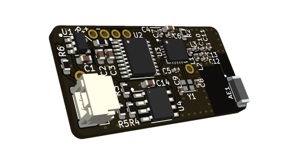

# Resistance Telemetry

*🚧 Feature complete. Docs to be polished.*

A compact sensor for a variable resistance that transmits data through BLE. A client program provides an interface for plotting and inspecting values on a desktop computer.

The device is physically compact (3.3 cm × 1.7 cm, around the size of the battery cell plus the antenna). It is powered by a LIR2016 cell and requires no setup on the computer side. Resolution is 24-bit, but no extensive calibration has currently been carried out. Designed for laboratory use, e.g. for e-skin gloves user studies.

## Directory structure

- **hardware/**: Circuit board design files.
- **firmware/**: Firmware (PlatformIO / C).
- **client/**: The client in C++. A Windows build is automated through [GitHub Actions](https://github.com/ayuusweetfish/Resistance-Telemetry/actions).
- **misc/**: Miscellaneous files and backups.
  - **STM32F1_test1/**: Test BLE transmission on a [blue pill](https://stm32-base.org/boards/STM32F103C8T6-Blue-Pill.html) board.
  - **compress_24b.c**: Data compression through least-squares quadratic fitting. Not employed in the final version due to nonnecessity for further enhancement.

## Permit

All content in this repository is released under [CC BY-NC-SA 4.0](https://creativecommons.org/licenses/by-nc-sa/4.0/). Additionally, software source code is dual-licensed by [Hippocratic License 2.1](https://spdx.org/licenses/Hippocratic-2.1.html).
